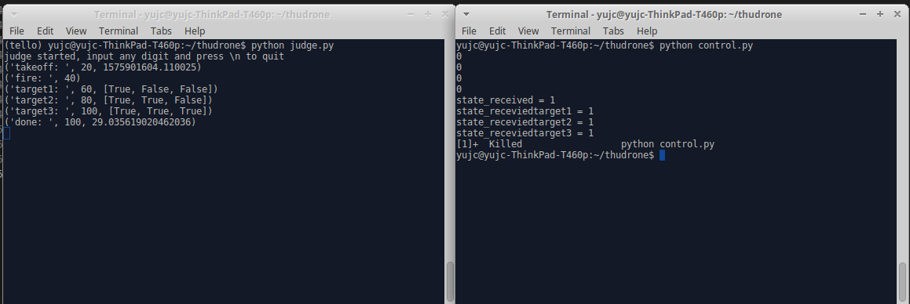

# 上位机模拟程序和无人机与上位机交互例程

## 文件组织

该项目中有两个文件，judge.py 和 control.py

其中 judge.py 为本地的上位机模拟器。control.py 为整体与上位机交互流程。同学们可以参考 control.py 的写法在自己的程序中添加上位机交互代码。

待检测的三个物体由布置场地的过程中通知选手，建议选手预留可配置接口。根据场地布置结果修改目标物体。

## judge.py

新建终端，直接运行 

```Shell
    python judge.py
```

在本地新建了一个上位机裁判逻辑终端。可以通过修改 judge.py 第9行， GROUP_INDEX 变更小组编号。

要退出模拟器终端很简单，在终端中输入数字，回车即可退出。

judge.py 第12行：```aim_objs = [0,3,4]``` 代表需要找的物体对应的编号为 0(猫)，3（小孩），4（煤气罐）

ID对应的是 ['cat','painting','files','baby','gas tank']

judge.py 第13行： ```targets = [3,4,5]``` 代表目标的三个物体所在柜子的编号。 第一个物体在3号柜子上，第二个物体在4号柜子上，第三个物体在5号柜子上。


## control.py

control.py 是一个例子程序，表示了流程。

新建终端，直接运行。（需要在启动 judge.py 之后运行）

```Shell
    python control.py
```

control.py 23到83行，是接收上位机的数据。并更新全局变量。

control.py 84到165 行，利用全局变量，给出了一个全流程与裁判机交互的例子。

## 使用

先在终端A（左侧）运行 judge.py。再在终端B（右侧）运行 control.py。 
可以看到contrl.py与judge.py 的交互过程。

运行结果如下图


